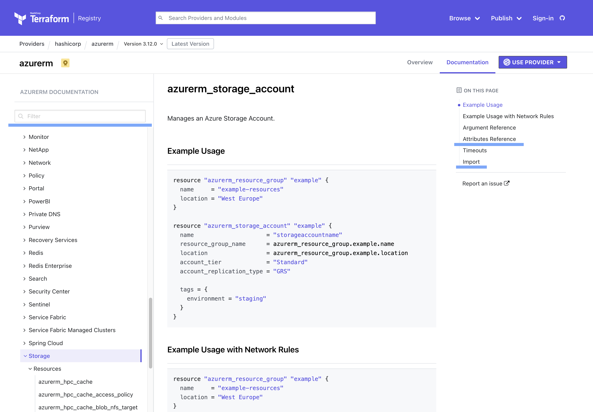

# Terraform-101 - Companion Skript

Terraform 101 ist ein Workshop/ Tutorial zur ersten Nutzung von Terrafrom mit Beispielen der Azure Cloud. Dies hier ist ein Companion Skript zum eigentlichen Workshop, sowie ein Repository mit den verwendeten Beispielen. Solltest du nicht an dem Workshop teilgenommen haben, ruf mich an und buche gerne einen Termin unter [Fingineering](https://finginerring.net) oder [DATANOMIQ](https://datanomiq.de).

## Voraussetzungen

- Installation eines Editors: in der Demo VS Code
- Installation einer Shell, auf der Windows Plattform: PowerShell
- Installation der Azure CLI
- Installation von Terraform und Terraform Doc

**Pro-Tip**: Nutzen von Chocolatey auf der Windows Platform als Paketmanager. Darüber kann Terraform installiert werden mittels:

```powershell
choco install terraform terraform-docs
```

Auch das Aktualisieren von Terraform wird dann einfacher mittels:

```powershell
choco update all
```

## Was ist Terraform

- Laut HashiCorp (Der Entwickler von Terraform) ein Infrastructure as Code Tool. Welches es ermöglicht Infrastruktur Resourcen in der Cloud und On-Premise zu verwalten.
- Das besondere ist: Terraform ist deklarativ
- Terraform benötigt keinen zentral laufenden Service, wie z.B. Chef oder Puppet
- Die Gesamte Infrastruktur wird in ASCII beschrieben, ist daher Plattform übergreifend zu verwalten und kann auch ohne spezielle Tools gelesen werden

**Drei Schritte zur Infrastruktur**

1. **Schreiben**: Erstellen von Infrastruktur Deklaration in der Sprache HCL. Dabei wird die zu erstellende Infrastruktur in allen Teilen die am Ende vorhanden sein sollen beschrieben. Es wird nur die Ziel Konfiguration beschrieben, nicht wie man dort hin kommt
2. **Plan**: Testen der beschriebenen Konfiguration, und überprüfen, ob auch wirklich die Änderungen vorgenommen werden, die gewünscht sind. Quasi ein Trockenlauf, hier kann nachvollzogen werden, welche Einstellungen vorgenommen werden und welche Infrastruktur am Ende zu erwarten ist

```bash
terraform plan
```

1. **Anwenden**: Im letzen Schritte werden die geplanten Änderungen dann auf den Zielträger der Infrastruktur angewendet, also auf dem gewählten Hyperscaler oder auf der angesprochenen Hardware/ Virtualisierungslösung

```bash
terraform apply
```

**Terraform statefiles**

Der erwartete Sollzustand der Infrastruktur wird in einem sogenannten Statefile gespeichert.

## Ein Terraformprojekt starten

Zum Start eines neuen Terraform Infrastrukturprojekts wird nur ein leerer Ordner benötigt. In diesem Ordner werden die zu erstellenden und zu verwaltenden Ressourcen in Textdateien mit der Endung `.tf` abgelegt

Per Konvention wird zunächst eine Datei ``main.tf`` erstellt, in dieser wird definiert, welche Infratrukturprovider verwendet werden sollen, quasi welche Infrastruktur Libraries verwendet werden sollen und wie diese zu konfigurieren sind.

```terraform
terraform {
  required_providers {
    local = {
        source = "hashicorp/local"
        version = ">=2.2.2"
    }
    curl = {
      source = "anschoewe/curl"
      version = "1.0.2"
    }
  }
}

provider "local" {
}
provider "curl" {

}
```

In der ersten Zeile wird Terraform als solches konfiguriert, es wird mitgeteilt, das im Projekt zwei Provider benötigt werden, *local* und *curl.* Terraform init wird damit die beiden provider aus der Terraform Registry importieren.

Anschließend können die importierten Provider mittels eines ``provider`` Blocks konfiguriert werden.

Nachdem die `[main.tf](http://main.tf)` Datei erstellt wurde, wird das Terraform Projekt initialisiert mittels

```bash
terraform init
```

## Erstellen einer Ressource

Wie im ersten Bespiel gezeigt, besteht die Beschreibung von Infrastruktur in Terraform HCL aus Blöcken und definierten Attributen. Eine Ressource wird dabei immer als ein Block definiert, die Ressourcenbnlöcke strukturieren sich wie folgt: 

```terraform
resource "provider.resourcen_typ" "Name_der_Ressource" {
	Parameter = "Wert"
}
```

Erstellen wir zum Testen nun mittels Terraform ein Ressource, eine lokale Datei

```terraform
resource "local_file" "foo"{
  content = "This is fill text"
  filename = "${path.module}/foo/bar.baz"
}
```

Nun haben wir den ersten Schritt **Schreiben** erledigt. Der nächste Schritt ist daher **Planen** dies machen wir mittel ``terraform validate`` zur syntaktischen Prüfung der Datei und ``terraform plan`` zum ermitteln des Transformationsplanes.

Wenn die zu erwartenden Änderungen dem entsprechen, was wir umsetzen wollen, dann können wir diese mittels ``terraform apply`` anwenden.

Neben den Ressourcen gibt es auch noch ``data`` und ``output`` Blöcke in Terraform um Parameter aus resources zu verwenden und um diese nach dem Anwenden auszugeben. Mit folgenden Blöcken, werden wir uns unsere aktuelle IP mittels des curls providers auf der Commandozeile ausgeben lassen. Die aktuelle IP können wir auch in anderen ``resources``im folgenden verwenden.

```terraform
// locale ip
data "curl" "myip" {
    http_method = "GET"
    uri = "https://api.ipify.org"
}
locals {
  my_ip  = data.curl.myip.response
}

output "my_ip" {
  value = local.my_ip
}
```

## Verwenden von Providern für Azure

Terraform wird in vielen Bereich verwendet, lokales Datei und Ordner Management gehört weniger dazu. In vielen Fällen wird Terraform zur Verwaltung von Ressourcen bei den großen Cloud Providern genutzt. Im Folgenden betrachten wir den Provider für Azure und Azure DevOps.

Für diese Teile der Azure Cloud werden jeweils zwei separat gepflegte Provider genutzt. Zum Einen der offizielle Azure Terraform Provider ``azurerm`` 

```terraform
terraform {
    required_providers {
      azurerm = {
      source  = "hashicorp/azurerm"
      version = ">=3.9.0"
    }
    }

}

provider "azurerm" {
  features {
    key_vault {
      purge_soft_delete_on_destroy = true
    }
  }
  subscription_id = var.subscription_id
}
```

Zum Anderen der Provider für Azure DevOps ``azuredevops``

```terraform
terraform {
    required_providers {
      azuredevops = {
				source  = "microsoft/azuredevops"
	      version = ">0.1.0"
    }
}

provider "azuredevops" {
  org_service_url       = "https://dev.azure.com/<name_of_organization>/"
  personal_access_token = var.personal_access_token
}
```

Wie im obigen Beispiel können auch beide Provider in einem Block deklariert werden und gemeinsam in einem Projekt genutzt werden. Im Beispiel des Azure Providers wird die Azure SubscriptionID benötigt, diese wollen wir nicht in unserem Git Repository veröffentlichen. Gleiches gilt für so etwas wie den personal_access_token aus Azure DevOps oder andere Secrets. Hierzu können Variablen verwendet werden, welche über eine Umgebungsvariable oder eine ``.tfvars`` Datei in das Projekt eingeschleust werden. Wenn die Datei ``terraform.tfvars``genannt wird, so wird diese automatisch verwendet. Bei anderen Namen muss die Datei mittels des Parameters ``--var-file=dateiname.tf``explizit dem Aufruf mitgegeben werden.

Auch die Verwendung von Secrets aus einem Secret Manager wie dem Azure Key Vault ist möglich. 

**Update der Provider**

Da die Cloud sich ständig weiter entwickelt ist es notwendig, das auch die verwendeten Provider regelmäßig aktualisiert werden. 

Terraform speichert den verwendeten Stand des Providers im lock-file

Aktualisierung des Providers mittels

```powershell
terraform init --update
```

Es ist auch zu empfehlen das eigentliche Terraform Executable aktuell zu halten.

## Erstellen von Cloud Ressourcen

Nachdem also der Terraform Provider für Azure deklariert ist, können als nächstes Ressourcen in Azure erstellt werden. Als erstes erstellen wir uns eine Ressourcengruppe. In dieser Ressourcengruppe werden wir dann einen Blob Storage einrichten, mit einem Container.

```terraform
resource "azurerm_resource_group" "rg-demo_47829034u" {
  name     = "rg-demo_47829034u"
  location = var.azure_location
}
```

In der Definition des Blob Storages wird auf die Ressourcengruppe referenziert. Somit kann die Ressourcengruppe geändert werden, ohne in den abhängigen Ressourcen die Änderung manuell nach zuführen.

```terraform
resource "azurerm_storage_account" "demo_storage" {
    resource_group_name = azurerm_resource_group.rg-management.name
    name = "demo48uq9erhn"
    location = var.azure_location
    account_tier = "Standard"
    account_replication_type = "LRS"
} 
```

Neben der Verwendung der Referenz auf die Ressourcengruppe wird auch eine Umgebungsvariable zur definition der Location der Ressourcen verwendet. Diese Variable enthält keine schützenswerte Information, daher kann dieser auch direkt mit einem Wert im Code deklariert werden.

```terraform
variable "azure_location{
	type = string
	default = "westeurope"
}
```

## Gemeinsam an Ressourcen arbeiten

Nun haben wir Infrastruktur lokal definiert, in den meisten Fällen ist das keine gute Idee, meist wird gemeinsam an Infrastruktur gearbeitet. Wie funktioniert dies? Die Definition der Infrastruktur besteht aus Text Dateien, daher kann diese einfach über ein Git Repository ausgetauscht werden.

Für das gemeinsame Bearbeiten von Infrastruktur mit Terraform ist allerdings zu beachten, das Terraform ein Statefile anlegt. Diese Statefile sollte einzigartig sein und allen an der Infrastruktur Mitwirkenden zugänglich sein. Diese in ein Git Repo zu legen ist keine gute Idee. Es gibt nun 2 Möglichkeiten

1. Verwenden eines shared states. Das werden wir im folgenden nutzen. Dazu werden wir im Storage Account, welchen wir angelegt haben einen Container hinzufügen und diesen als backend im Terraform Block nutzen.
2. Verwendung von Terraform Cloud. Terraform Cloud ist Terraform as a Service. Dabei wird sowohl der State in der Terraform Cloud gespeichert, als auch terraform selbst in einer Cloud Ressource ausgeführt. Hierbei ist zu beachten, dass sowohl DSGVO Themen, als auch Sicherheitsfragen zu klären sein können.

Mit folgendem Stück HCL Code wird der Blob Container zum shared state storage. 

```terraform
backend "azurerm" {
    resource_group_name  = "rg-demo_47829034u"
    storage_account_name = "demo48uq9erhn"
    container_name       = "tfstate"
    key                  = "prod.terraforn.tfstate"
  }
```

Nachdem nun das Backend geändert wurde, muss terraform neu initialisiert werden. Terraform fragt dann, ob der state migriert werden soll. Geschieht dies nicht, so kann der Parameter ``-migrate-state`` mitgegeben werden. Terraform fragt an dieser Stelle auch nach einem Storage Account Access key, sofern dieser nicht über eine Variable mit vorgegeben wurde. Es kann auch eine Authentication via Azure CLI verwendet werden.

## Verwendung von Variablen, Parameter von Ressourcen und Ausgabe von Daten

Terraform hat wie wir gesehen haben die Möglichkeit Variablen aus einem speziellen File zu lesen. Ebenso können diese Variablen aus Umgebungsvariablen gelesen werden, in letzterem Falle müssen die Variablen mit dem Namen TF_VAR_ beginnen. Häufig werden Variablen genutzt um sensitive Informationen in den Terraform run zu injizieren, sollen die Inhalte der Variablen nicht auf der CLI ausgegeben werden, dann können Variablen als sensitive=True markiert werden.

Variablen können vom Typ string, number oder bool sein, zusätzlich gibt es auch komplexere Datentypen, wie list, map oder object.

Neben der Nutzung von Variablen können auch Attribute von anderen Ressourcen verwendet werden um Ressourcen zu konfigurieren. Diese Attribute müssen dann nach dem Schema <resource_type>.<resource_name>.<attribute_name> angesprochen werden. Im unserem Beispiel, wird z.b. der Name der Ressourcengruppe so in der Definition des Storage Accounts verwendet.

Besteht der Bedarf nach Ausgabe von Attributen der erstellten oder verwendeten Ressourcen, so können die Attribute, wie im ersten Beispiel gezeigt, über einen `data` Block addressiert werden und mittels des ``output`` Block dann auf der CLI ausgegeben werden.

## Weitere Themen

Einige Themen werden im Umgang mit Terraform immer wieder benötigt, sind aber nicht direkt ein Teil der Workshops. Hier eine List von hilfreichen Hinweisen.

### Finden von Dokumentation

Wie und wo kann Beschreibung der Provider gefunden werden? Die meisten Provider finden sich in der [Terraform Registry](https://registry.terraform.io/). Hier sind die offiziellen und viele open source provider gelistet. Diese können in Terraformprojekten verwendet werden. 

Hat man einen passenden Provider ausgemacht, so kann in dem Provider nach den Ressourcen und deren Beschreibung gesucht werden. Neben Beispielen und der Arguments Reference findet sich am Ende der Dokumentation einer Ressource meist auch eine Beschreibung, wie diese in ein bestehendes Projekt importiert werden kann.



### Importieren von Ressourcen

Es kommt immer wieder vor, das eine Ressource im Azure Portal oder auch via CLI erstellt wird, um die Infrastruktur vollständig abzubilden, ist es aber notwendig diese Ressourcen auch im Terraform Projekt aufzunehmen. Nein, die Ressource muss nicht gelöscht werden, einfacher ist folgendes Vorgehen:

1. Erstellen der Ressourcenbeschreibung in HCL im Terraform Projekt
2. Importieren der Ressource mittels `terraform import`
3. Anpassen der Attribute der Ressource, sodass die Konfiguration der Ressource dem Ist bzw. dem Soll entspricht.

```powershell
terraform import --var-file=vars.tfvar resource_typ.resource_name /id/oder/Link/to/resource/in/Azure
```

Sollte die Id der Ressource nicht so einfach via AZ oder Portal zu finden sein, dann hilft meist auch ein Blick in die Terraform Dokumentation. Am Ende der Beschreibung der meisten Ressourcen, in der Provider Dokumentation, findet sich ein Beispiel für ein Import statement.

Da es häufig nicht ohne weiteres zu ersichtlich ist, wie eine Ressource genau definiert ist, kann es notwendig sein, zunächst einen minimalen Dummy in der `.tf` Datei zu erzeugen und anschließend mittels `terraform plan --var-file=vars.tfvars` den Abgleich zur eigentlichen Ressource zu führen. Werden Änderungen an der Ressource vorgeschlagen, so können diese anschließend wieder in die `.tf` Datei übernommen werden oder werden überschrieben bei einem `terraform apply`.

## Fragen und Kontakte

Wenn dieses Tutorial hilfreich für dich war, dann lass doch gerne einen Stern da oder:

[](https://www.buymeacoffee.com/owil)

Hast du Fragen zum Thema IaC mit Terraform? Schau doch gerne auf [Fingineering](https://fingineering.net) oder [DATANOMIQ](https://datanomiq.de) vorbei oder erstelle in Issue hier in Github.
